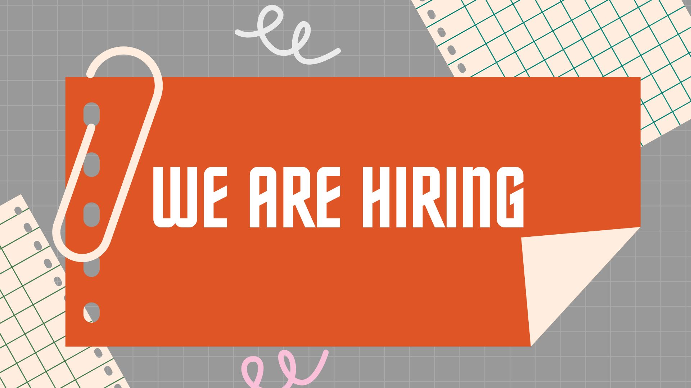

**Location:** Bugiri, Kamwenge, Kabale, Kyegegwa, Isingiro, Sironko, Kassanda, Kibaale, Kyenjojo, Bunyangabu, Kagadi, Kakumiro, Kiryandongo, Amuru, Nwoya, Kitagwenda, Buhweju, Mitooma, Rubanda, and Rukiga  
**Employment Type:** Full-time  
**Experience:** 2+ years  
**Travel Required:** Up to 90%  
**Reporting To:** Project Officer  
**Languages:** English, Luo, Rutooro, Rukiga, Lusoga, Rufumbira, Runyankole, Runyakitara, Luganda, Lugisu, and Kupsabiny  

## Roles & Responsibilities  

### Project Implementation  
- Conduct project design review meetings with partner villages and provide feedback to update project designs and budgets.  
- Coordinate and co-facilitate training activities, including financial literacy, behavior and mindset change, water and health sanitation, village savings and loans associations, agriculture, livestock care, and health outreaches.  
- Implement RTV’s project methodologies to increase household income and reduce extreme poverty.  
- Develop and submit a list of required goods and services for procurement.  
- Verify goods/inputs prior to distribution.  
- Conduct project follow-up and provide support to community groups and individual households.  
- Identify potential risks and provide mitigation measures.  
- Conduct regular meetings with leadership and community members on project performance and perceptions.  

### Reporting and Administration  
- Develop and manage work plans.  
- Complete field reports weekly and contribute to donor reporting and proposal writing.  
- Participate in weekly staff and cluster team meetings.  
- Submit financial requests, reports, and accountabilities to the Senior Project Officer.  
- Take and share photographs for data repository.  

### Monitoring and Evaluation  
- Provide feedback and recommendations to the Project Officer, Senior Project Officer, and program team.  
- Suggest improvements for RTV’s methodologies and project sustainability.  

**Note:** Additional responsibilities as assigned by the supervisor or management.  

---

## Requirements and Experience  

### Technical and Administrative Skills  
- Strong training & facilitation skills.  
- Excellent verbal and written communication skills in English.  
- Fluency in local languages spoken in RTV project areas.  
- Proficiency in Microsoft Office (Word & Excel).  
- Understanding of Community-Based Development Principles.  
- Ability to organize work effectively while managing changing priorities and deadlines.  
- Capable of independent work and teamwork to achieve objectives.  
- Creative problem-solving skills.  
- Strong work ethic, flexibility, and ability to build relationships with stakeholders.  
- Positive attitude in a fast-paced and challenging environment.  
- Physically fit and able to hike high terrain.  
- Ability to travel approximately 90% of the time.  
- **Motorbike riding skills are a strong advantage.**  

### Education and Experience  
- Bachelor’s degree in Social Science, Social Work, Humanities, Community Development, or a related field.  
- Minimum of two (2) years of relevant field experience at the community level.  

---

## Application Process  
To apply, please submit your application by **February 27, 2025**.  

**Raising The Village** is an equal-opportunity employer committed to diversity and inclusion. **Women are highly encouraged to apply.**

**How to apply:**

1. Click the "Apply Now" button below.
2. Fill out the application form.
3. Upload your resume and cover letter.
4. Submit your application.

<!-- add apply now button -->
<a href="https://docs.google.com/forms/d/e/1FAIpQLScirg3p15viIIrGIZAsbi1cWxyu9zsCb38WmjMXdg2CKnDaqg/viewform" target="_blank" class="btn text-white" style="background-color: #008374; color: white;">Apply Now</a>

**Note:** Only shortlisted candidates will be contacted.

